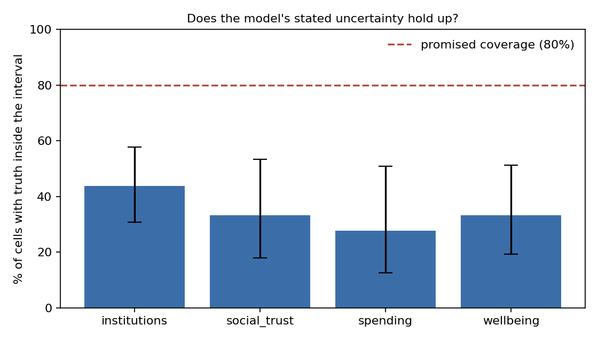
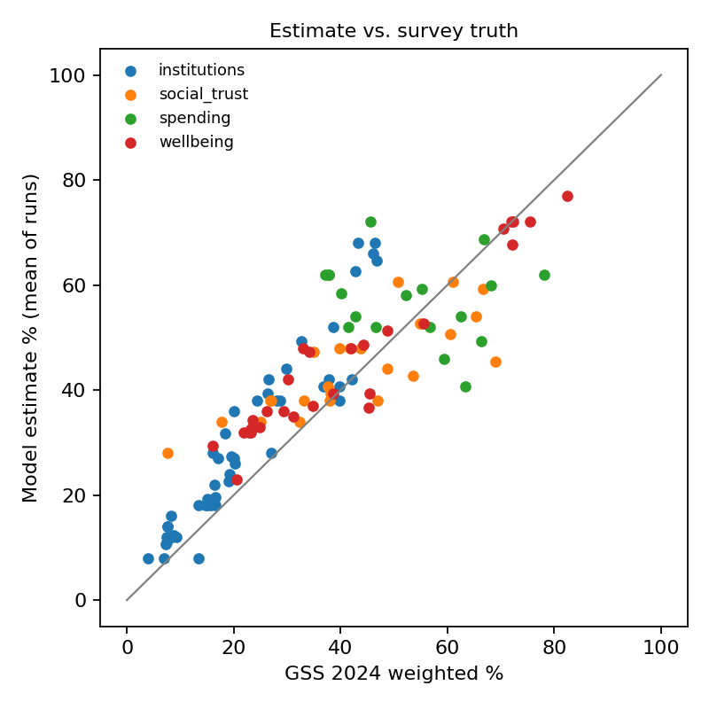
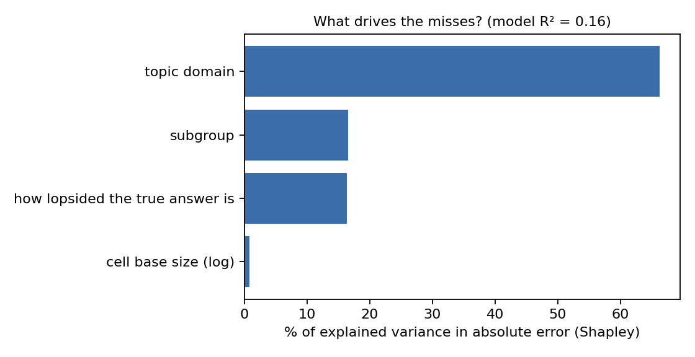

# Synthetic Respondent Audit

**Can an LLM stand in for a survey panel? And when it's wrong, does it know?**

Research teams are being pitched synthetic respondents as a faster, cheaper panel. Before a team bets a tracker on one, two things are worth measuring: accuracy against real results, and whether the model's stated uncertainty can be trusted. This repo tests both against the General Social Survey 2024, with the design pre-registered before the first model call.

## Design at a glance
- **Ground truth.** GSS 2024 (NORC), weighted, with 20 items across wellbeing, social trust, confidence in institutions, and spending priorities.
- **Cells.** 20 items × 6 subgroups = 120 weighted cells, each with a percentage and a standard error.
- **The ask.** For each cell, the model gives a best estimate and an 80% interval. There are 3 independent calls per cell.
- **Scoring.**
  - Interval coverage against the promised 80%, with Wilson CIs.
  - Absolute and signed error (does the model overstate the top-box answer?), and run-to-run consistency.
  - A Shapley key driver analysis of what predicts the misses.
- **Discipline.** The rules are committed and tagged (`seal-v1`) before any estimates exist. The git history proves the order. See [PREREGISTRATION.md](PREREGISTRATION.md).

## Results

**Run:** claude-haiku-4-5-20251001, September 2026. 120 cells, 3 runs each, 0 parse failures. Full output in [results/summary.md](results/summary.md).

- **Stated uncertainty doesn't hold.** The model's 80% intervals contained the true result 37% of the time (95% CI 29% to 46%). Intervals averaged 10.5 points wide against an average miss of 8.6 points.
- **It leans high on strong answers.** Estimates overstated the top-box share by 5.1 points on average. Real respondents sit in the middle options more than the model expects.
- **It's consistent, which makes it look more reliable than it is.** Repeat runs moved 1.6 points on average.
- **No sign of recalled toplines.** Total-population cells, the most likely to be published, were no easier than subgroup cells (20% vs. 40% coverage, on 20 and 100 cells).
- **The error drivers explain little** (R² = 0.16). Topic domain carries the largest share of what they do explain.

**Takeaway for a research team:** treat synthetic estimates as a hypothesis to test, not a panel substitute, and don't trust the model's own confidence ranges.





## What this does and doesn't show
It measures accuracy and calibration on questions with known answers, for one model on one survey. It doesn't tell you whether synthetic data is fit for a specific business decision. It's the kind of check I'd run before letting one near a real study.

## Run it
```bash
pip install -r requirements.txt
python src/prepare_truth.py          # downloads GSS 2024, writes data/truth.csv
export ANTHROPIC_API_KEY=...              # never commit this
python src/run_model.py                   # about 360 short calls
python src/score.py                       # writes results/
```
`--mock` on `run_model.py` and `score.py` tests the pipeline with fake estimates. Every mock output is stamped MOCK and git-ignored.

## Data credit
Davern, Michael; Bautista, Rene; Freese, Jeremy; Herd, Pamela; and Morgan, Stephen L.; General Social Survey 1972-2024. [Machine-readable data file]. Principal Investigator, Michael Davern; Co-Principal Investigators, Rene Bautista, Jeremy Freese, Pamela Herd, and Stephen L. Morgan. NORC ed. Chicago, 2026. 1 datafile (Release 3a) and 1 codebook (2024 Release 3a). Only derived toplines are stored in this repo.

---
Thomas Hornacek · [thomashornacek.com](https://thomashornacek.com) · consumer insights and analytics
